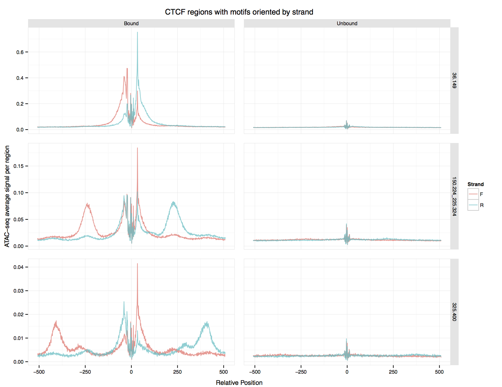

========
Usage
========

Command-line applications
=========================

Adapter trimming
----------------

The trim_adapters utility is based on a script by Jason Buenrostro
(see `the original ATAC-seq paper`_: Buenrostro, Jason D; Giresi, Paul
G; Zaba, Lisa C; Chang, Howard Y; Greenleaf,
William J. 2013. *Transposition of native chromatin for fast and
sensitive epigenomic profiling of open chromatin, DNA-binding proteins
and nucleosome position*. Nat Meth 10, 1213–1218.)

Instead of looking for known adapter sequence, it aligns paired reads
to each other and trims off sequence outside the alignment. More
precisely, it searches the forward read for the reverse complement of
a specified number of bases (20 by default) at the beginning of the
reverse read, then falls back to finding the best alignment of the two
reads, using the minimum Levenshtein distance between them.

Changes from the original script:

* The ``--max-edit-distance`` option to specify the maximum edit distance
  when aligning the reads.
* The ``--fudge`` option to not trim a base from the result to satisfy
  bowtie -- other aligners like bwa don't have the apparent problem
  with exactly overlapping reads. The default is 1 for compatibility
  with the original script.
* The ``--rc-length`` option to specify the amount of the reverse read to
  reverse complement and search for in the forward read.
* The ``--trim-from-start`` option to remove extra bases from the
  beginning of each read. We found this necessary with OH-seq.
* Output is gzipped.

Cut matrix generation
---------------------

The ``make_cut_matrix`` script can be used to generate two types of
matrices by counting the ATAC-seq cut points (transposition sites)
around known motifs, given a BAM file of aligned reads from an
ATAC-seq experiment and a BED file of motifs.

Discrete matrices
^^^^^^^^^^^^^^^^^

The first type of output, which we call `discrete`, is intended to
produce input for CENTIPEDE. The output matrix contains a row for each
motif, representing the cut point counts at positions within and
around the motif for each fragment size bin. For each fragment size
bin and resolution you specify, the cut points at each position in the
motif and an extended region you specify are counted, and every
`resolution` positions in the extended area on either side of the
motif are summed. So each row will contain for each fragment size bin
a sequence of (possibly aggregated) scores in the region upstream of
the motif, a sequence of scores for each position in the motif, and a
sequence of (possibly aggregated) scores in the region downstream of
the motif.

An example invocation::

  make_cut_matrix -d -b '(36-149 150-324 325-400 1)' -p 8 \
    input.bam \
    JASPAR2014_CTCF.bed.gz | \
    gzip -c > CTCF.discrete.matrix.gz

That would count any reads with lengths between 36-149, 150-324, and
325-400 from ``input.bam`` whose cut points fell in the specified
region around motifs from ``JASPAR2014_CTCF.bed.gz``. The cut point
counts would be recorded for each fragment size bin, at nucleotide
resolution (with no score aggregation in the extended region around
each motif). Since the length of the extended region was not
specified, it would use the default. The program would use eight
concurrent scoring processes, and the output would wind up in
CTCF.discrete.matrix.gz.

Aggregate matrices
^^^^^^^^^^^^^^^^^^

After you've run CENTIPEDE with the resulting `discrete` matrix, and
identified bound and unbound motifs (perhaps using posterior
probabilities of at least 0.95 or at most 0.5, respectively), you can
move on to generating what we call `aggregate` matrices.  These are
designed for creating a plot of the ATAC-seq signal around a single
motif.

An `aggregate` matrix contains a row for each combination of position,
fragment size bin, and strand within and around the motif, with
columns representing the absolute and average cut point counts at each
position.

An example invocation, using a BED file of bound motifs::

  make_cut_matrix -a -b '(36-149 150-324 325-400 1)' -p 8 \
    input.bam \
    CTCF_bound.bed.gz | \
    gzip -c > CTCF_bound.aggregate.matrix.gz

Do the same for your unbound motifs, and you're ready to plot.

Binning
^^^^^^^

For either matrix, we count cut points in groups of bins according to
the length of the reads' fragments, with optional reduction of scores
in regions around motifs to a resolution you specify for each
group. This is regrettably complex to explain, so I will resort to
crude pictures.

Assume you want to count cut points from fragments with lengths in the
following ranges at different resolutions:

====================  ==========
Fragment bin group    Resolution
====================  ==========
36-149                1
150-224 and 225-324   2
325-400               5
====================  ==========

The command line specification for this scenario would look like
this::

  make_cut_matrix -a -b '(36-149 1) (150-224 225-324 2) (325-400 5)' ...

Pretend you're scoring a motif 5 bases long, with a 10-base extended
region on either side, and for simplicity, pretend that each template
length bin had the same counts of cut points around the motif, shown
here::

  extended region     motif     extended region
  ------------------- --------- -------------------
  0 1 2 3 3 4 4 4 4 5 9 2 0 2 7 5 4 4 4 4 3 3 2 1 0

The matrix would contain scores for each position in the first bin
group, ``(36-149 1)``::

  extended region     motif     extended region
  ------------------- --------- -------------------
  0 1 2 3 3 4 4 4 4 5 9 2 0 2 7 5 4 4 4 4 3 3 2 1 0

The second bin group, ``(150-224 225-324 2)`` would contain sums of
every two scores in the extended region, plus every score in the motif
itself::

  extended region                 motif     extended region
  ------------------------------- --------- ------------------------------
  (0+1) (2+3) (3+4) (4+4) (4 + 5) 9 2 0 2 7 (5+4) (4+4) (4+3) (3+2) (1+ 0)

resulting in::

  e.r.      motif     e.r.
  --------- --------- ---------
  1 5 7 8 9 9 2 0 2 7 9 8 7 5 1

Furthermore, since this group contains two bins, what ultimately goes
into the output matrix would be the entrywise sum of each bin's scores.

The scores for the last bin group, ``(325-400 5)``, after adding every
five scores in the extended region::

    e.r. motif     e.r.
    ---- --------- ----
    9 21 9 2 0 2 7 21 9

Creating ATAC-seq signal plots for motifs
-----------------------------------------

The output of ``make_cut_matrix --aggregate-output`` can be plotted
with ``plot_aggregate_matrix.R``. Pass it the aggregate output for a
bound motif, the aggregate output for an unbound motif, a title for
the plot and the name of the PDF file in which to save the plot.

An example of the output produced by::

  plot_aggregate_matrix.R CTCF_bound.aggregate.matrix CTCF_unbound.aggregate.matrix "CTCF regions with motifs oriented by strand" CTCF.pdf

Using the ``atactk`` library
============================

There are several modules in the ``atactk`` package that you might
find useful in processing ATAC-seq data, particularly ``atactk.data``
and ``atactk.metrics``.

The ``atactk.data`` module simplifies reading and manipulating
features from BED files. It handles gzipped or uncompressed files
automatically, and makes it simple to filter aligned segments from a
BAM file using standard SAM flags. It also makes it easy to read two
FASTQ files simultaneously, producing a sequence of paired reads.

The ``atactk.metrics`` module makes it easy to measure ATAC-seq cut
points around a feature.

There are also the ``atactk.command`` and ``atactk.util`` modules,
which support parsing of our interval specifications and provide some
generic functional tools used in the other modules.

We've made an effort to ensure the library is completely documented
(see the :ref:`modindex`). If you find the documentation incomplete or
unclear, please file a bug report.

.. _the original ATAC-seq paper: http://dx.doi.org/10.1038/nmeth.2688
